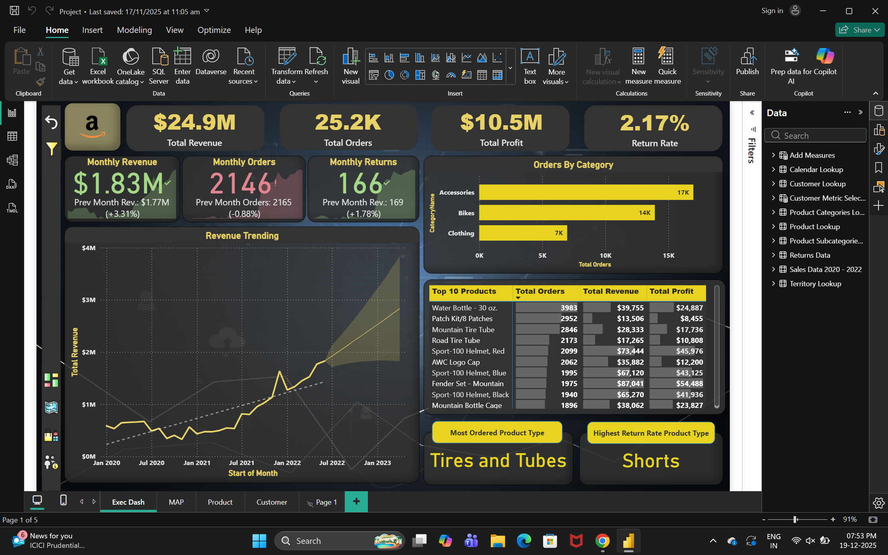
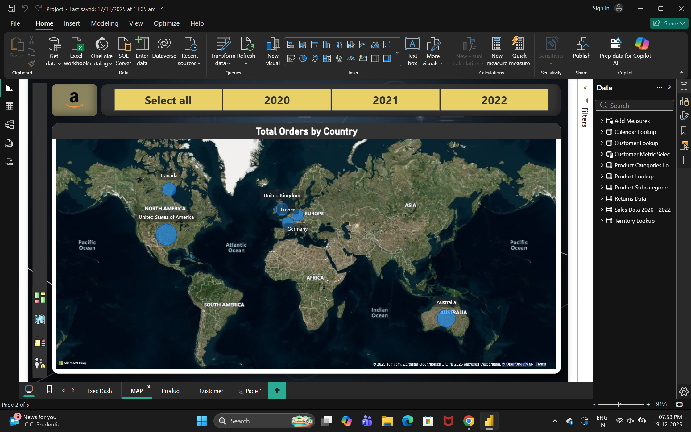
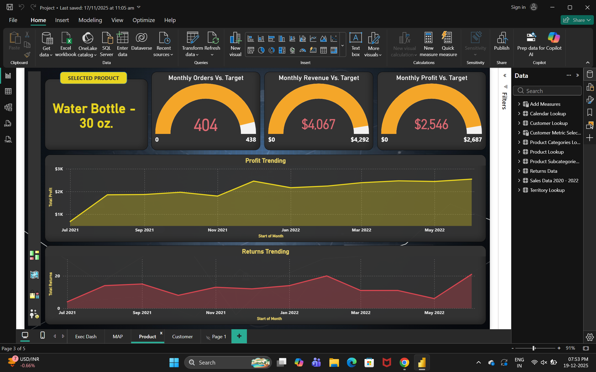
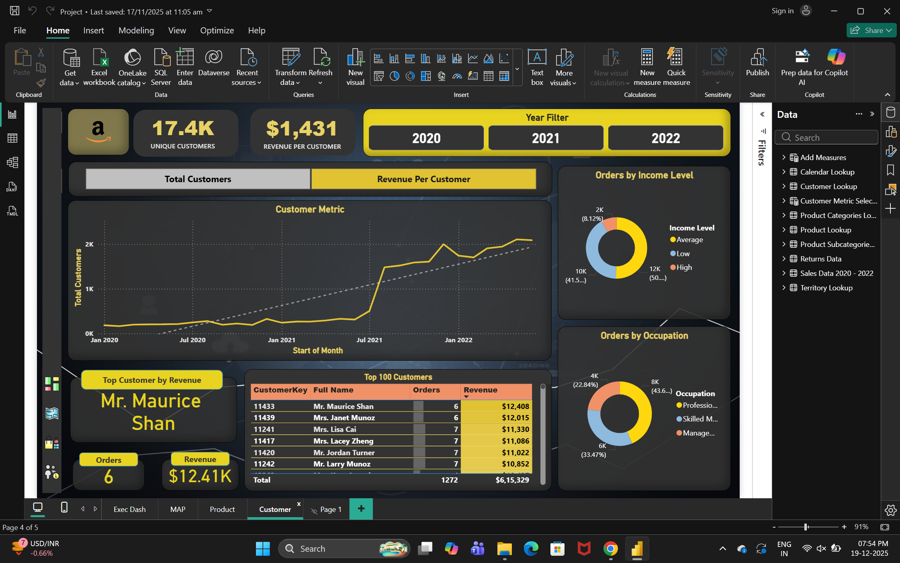
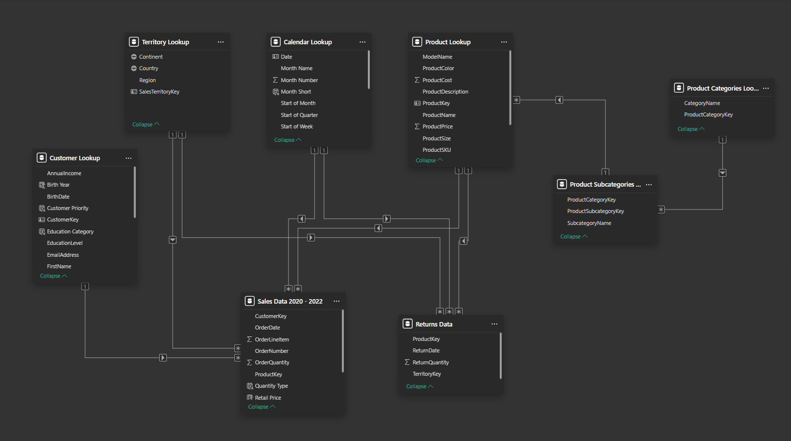

# 📦 Amazon Global Sales Analysis

  

## 🎯 Project Overview
This Power BI project provides a deep-dive analysis of Amazon's sales performance. By transforming raw transactional data into actionable insights, this dashboard tracks revenue growth, identifies high-profit product categories, and analyzes customer geographic distribution to optimize marketing and inventory strategies.

## 📂 Project Resources
Due to the large file size of the dataset and the Power BI report, the original files are hosted on Google Drive:

* **[Download Full Dataset (CSV)](https://drive.google.com/drive/folders/1hNZlC-M1Dv4WjPXFDBQvleKClPAaPEsk?usp=sharing)** 📁
* **[Download Power BI Report (.pbix)](https://drive.google.com/file/d/1eFhU5YJ0sNOS40ycY6X11oXfY_5vJyFz/view?usp=sharing)** 📊

---

## 🖼️ Dashboard Visuals

### 1. Executive Summary
The main landing page provides high-level KPIs including Total Revenue, Profit Margin, and Year-over-Year growth.

### 2. Geographic Sales Distribution
An interactive map view used to identify regional hotspots and underperforming territories.

### 3. Product & Category Performance
A detailed breakdown of product success, identifying top-movers and high-margin stock.

### 4. Customer Insights
Detailed segmentation of customer purchasing behavior and frequency.

---

## 🚀 Technical Highlights

### 1. Data Modeling (Star Schema)
To ensure optimal performance and accurate filtering, I implemented a **Star Schema**. This model connects a central **Sales Fact Table** to multiple **Dimension Tables** (Product, Customer, Geography, and a custom Calendar table). Proving a structured data model is key to efficient Power BI reports.

### 2. Advanced DAX Analysis
I authored custom DAX formulas to drive deeper business intelligence:
* **Time Intelligence:** Utilized `TOTALYTD` and `SAMEPERIODLASTYEAR` for accurate trend comparisons.
* **Profitability Metrics:** Created dynamic measures for **Net Profit %** and **Average Order Value (AOV)**.
* **Ranking:** Implemented `RANKX` to identify the Top 10 products by revenue dynamically across categories.

### 3. Power Query Transformation (ETL)
* Cleaned and standardized messy address strings into clean geographic hierarchies.
* Handled null values and outliers in shipping cost columns to maintain data integrity.
* Optimized data types to reduce file size and improve report refresh speeds.

## 💡 Key Business Insights
* **Revenue Drivers:** Analysis shows that high-volume categories often have lower margins, requiring a balanced promotional strategy.
* **Market Expansion:** Regional analysis identified significant growth potential in under-served geographic zones.
* **Operational Efficiency:** Identified a correlation between specific shipping methods and product return rates, suggesting a need for logistics optimization.

---

## 🛠️ How to Use
1. **Interactive Experience:** If you have Power BI Desktop, download the `.pbix` from the link above to interact with the slicers and drill-throughs.
2. **Static Review:** Use the images in this repository to review the UI/UX design and data architecture.

## 🏷️ Tags
`power-bi` | `dax` | `data-modeling` | `amazon-sales` | `business-intelligence` | `star-schema` | `data-visualization`
